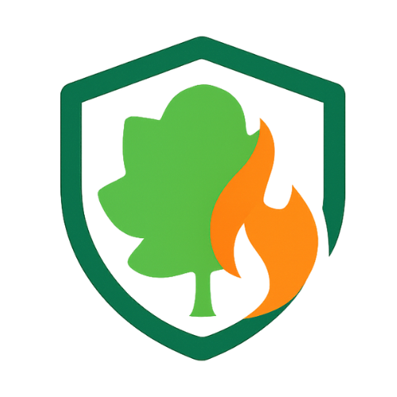

<div align="center">



# 🔥 FIRO — Wildfire Detection System
### Edge AI · Real-Time Monitoring · Forest Fire Early Warning

[](https://python.org)
[](https://tensorflow.org/lite)
[](https://firebase.google.com)
[](https://www.raspberrypi.com)
[](LICENSE)

> **FIRO** is a lightweight, real-time wildfire detection system built for resource-constrained edge devices. A MobileNetV2 model — optimized to TensorFlow Lite INT8 — runs directly on a Raspberry Pi 5, classifying forest camera images and pushing fire alerts to a web dashboard and WhatsApp, all without relying on cloud compute.

**BS Final Year Project · Department of Data Science · University of Kotli, AJK**  
*Ahmed Ali · Seher Ishtiaq · Supervisor: Mr. Nabeel Ali · Session 2021–2025*

---

</div>

## 📋 Table of Contents

- [Overview](#-overview)
- [System Architecture](#-system-architecture)
- [Key Features](#-key-features)
- [Tech Stack](#-tech-stack)
- [Repository Structure](#-repository-structure)
- [Model Performance](#-model-performance)
- [Getting Started](#-getting-started)
  - [Prerequisites](#prerequisites)
  - [Dashboard Setup](#1-dashboard-setup)
  - [Raspberry Pi Setup](#2-raspberry-pi-setup)
  - [Firebase Configuration](#3-firebase-configuration)
  - [Admin Setup](#4-admin-setup)
  - [Deploying to Vercel](#5-deploying-to-vercel)
- [Website Pages](#-website-pages)
- [Edge Device Pipeline](#-edge-device-pipeline)
- [Results](#-results)
- [Motivation](#-motivation)
- [Future Work](#-future-work)
- [Authors](#-authors)

---

## 🌐 Overview

Wildfires in Pakistan — especially in Azad Jammu & Kashmir — are increasingly devastating. In 2024 alone, **2,214 high-confidence VIIRS fire alerts** were recorded across Pakistan. Traditional detection relies on satellite imagery (with 16-day revisit cycles), manual watchtowers, and public reporting — all too slow for early intervention.

**FIRO** (Fire Intelligence & Response Observatory) solves this by putting AI directly on the ground:

- A **USB camera** mounted on a forest tower feeds images to a **Raspberry Pi 5**
- An **INT8-quantized MobileNetV2** model runs fully on-device — no cloud compute needed
- Only lightweight metadata (fire/no-fire label, confidence, GPS, timestamp) is sent to **Firebase**
- Alerts reach **Forest Department staff via WhatsApp** and a **real-time web dashboard**

**97.5% accuracy · <1s inference latency · Runs on a $80 edge device**

---

## 🏗 System Architecture

```
┌─────────────────────────────────────────────────────────────────────┐
│                        EDGE LAYER                                   │
│                                                                     │
│   📷 USB Camera                                                     │
│       │  RGB frames                                                 │
│       ▼                                                             │
│   🖥️  Raspberry Pi 5                                                │
│   ┌─────────────────────────────────────────────────┐              │
│   │  1. Capture image at timed intervals             │              │
│   │  2. Resize to 224×224 · Normalize pixels        │              │
│   │  3. Run MobileNetV2 Lite (INT8 TFLite)          │              │
│   │  4. Get: { label, confidence, timestamp, GPS }  │              │
│   └─────────────────────────────────────────────────┘              │
└──────────────────────────┬──────────────────────────────────────────┘
                           │  Metadata only (no raw images)
                           ▼
┌─────────────────────────────────────────────────────────────────────┐
│                       CLOUD LAYER (Firebase)                        │
│                                                                     │
│   🔥 Firestore → stores fire_logs collection                        │
│   🔐 Firebase Auth → secures dashboard access                       │
│   📡 Triggers → WhatsApp alerts on fire detection                   │
└───────────────┬─────────────────────────────────────────────────────┘
                │
                ▼
┌─────────────────────────────────────────────────────────────────────┐
│                     DASHBOARD LAYER                                 │
│                                                                     │
│   🌐 Website + Dashboard (HTML/JS, hosted on Vercel)                │
│   ├── Live map with camera locations (Leaflet)                      │
│   ├── Real-time alert panel (live Firestore listener)               │
│   ├── Event log history (filterable)                                │
│   └── Dark mode · PWA-enabled                                       │
└─────────────────────────────────────────────────────────────────────┘
```

---

## ✨ Key Features

| Feature | Description |
|---|---|
| 🧠 **On-Device Inference** | MobileNetV2 Lite (INT8) runs entirely on Raspberry Pi — no cloud compute |
| ⚡ **Real-Time Detection** | Images captured and classified continuously; results pushed in seconds |
| 📡 **Minimal Bandwidth** | Only compact metadata sent to Firebase — no raw image uploads |
| 🗺️ **Live Map Dashboard** | Leaflet-powered interactive map shows all camera locations and fire status |
| 🚨 **Instant Alerts** | WhatsApp notifications delivered to forest staff on fire detection |
| 🔐 **Secure Login** | Firebase Authentication guards dashboard access |
| 📜 **Event Log History** | Full searchable log of all detection events with timestamps |
| 🌙 **Dark / Light Mode** | Full theme support across all dashboard pages |
| 📱 **PWA Ready** | Installable as a mobile app via service worker + manifest |
| 📊 **Analytics View** | Last-hour analytics panel (`/analytics`) with map, alert panel and recent log table |
| 🌿 **Public Website** | Home, About, Blog, Report a Fire and Contact pages with an animated night-jungle theme |
| 🧯 **Public Fire Reporting** | Anyone can report smoke/fire with GPS location, map pin and photo |
| 🛡️ **Admin Panel** | Hidden `/admin` area to manage fire reports, contact messages and blog posts |

---

## 🛠 Tech Stack

### Edge Device (Raspberry Pi 5)
| Component | Technology |
|---|---|
| Language | Python 3.11 |
| ML Framework | TensorFlow Lite (INT8) |
| Model | MobileNetV2 (fine-tuned, quantized) |
| Camera | USB Camera (OpenCV capture) |
| Cloud Push | Firebase Admin SDK |

### Dashboard (Web)
| Component | Technology |
|---|---|
| Frontend | HTML5, Tailwind CSS, Vanilla JS |
| Maps | Leaflet.js |
| Auth | Firebase Authentication |
| Database | Cloud Firestore |
| Icons | Font Awesome 6 |
| PWA | Service Worker + Web App Manifest |
| Analytics Panel | Leaflet + Firestore (JavaScript) |

### Cloud & Infrastructure
| Component | Technology |
|---|---|
| Database | Firebase Firestore |
| Authentication | Firebase Auth (Email/Password) |
| Alerts | WhatsApp (via Firebase trigger) |
| Hosting | Vercel (static site + Python serverless function) |

---

## 📁 Repository Structure

```
FIRO-FYP/
│
├── 📂 public/                       # Everything Vercel serves (website + dashboard)
│   ├── index.html                   # Home page                                   → /
│   ├── about.html                   # About the project and team                  → /about
│   ├── blog.html                    # Blog list                                   → /blog
│   ├── post.html                    # Single article                              → /blog/<slug>
│   ├── report.html                  # Public "Report a Fire" form                 → /report
│   ├── contact.html                 # Contact form                                → /contact
│   ├── admin.html                   # Hidden admin panel (not linked anywhere)    → /admin
│   ├── 404.html                     # "Lost in the jungle" page
│   ├── dashboard.html               # Control room: Overview                      → /dashboard
│   ├── map.html                     # Control room: full-screen live map          → /map
│   ├── incidents.html               # Control room: citizen reports desk          → /incidents
│   ├── cameras.html                 # Control room: camera health                 → /cameras
│   ├── login.html                   # Firebase Auth login/signup                  → /login
│   ├── logs.html                    # Historical fire event log                   → /logs
│   ├── analytics.html               # Control room: historical analytics          → /analytics
│   ├── css/site.css                 # Website design system + jungle theme
│   ├── css/ops.css                  # Control-room design system (dark, high contrast)
│   ├── js/
│   │   ├── site.js                  # Nav bar, footer, toasts, scroll animations
│   │   ├── jungle-bg.js             # Animated night-jungle background (canvas)
│   │   ├── firebase-init.js         # Loads /api/config, initialises Firebase
│   │   ├── common.js                # Shared helpers (escaping, fire status, coords, theme)
│   │   ├── admin.js                 # Admin panel logic
│   │   ├── ops/data.js              # Control room: live data, incidents, workflow actions
│   │   ├── ops/shell.js             # Control room: top bar, kiosk, sound alerts, pop-out
│   │   ├── ops/charts.js            # Control room: SVG charts with table views
│   │   ├── ops/map.js               # Control room: Leaflet map layers
│   │   ├── blog.js / blog-data.js   # Blog loading + built-in starter articles
│   │   ├── markdown.js              # Safe Markdown rendering for posts
│   │   └── image-utils.js           # In-browser photo compression
│   ├── assets/logo.png
│   ├── manifest.json, service-worker.js, robots.txt
│
├── 📂 api/config.py                 # Vercel serverless function → GET /api/config
├── 📂 scripts/dev_server.py         # Local preview server (same routes as Vercel)
├── 📂 models/                       # INT8 quantized TFLite model
├── 📂 docs/                         # FYP thesis (PDF)
├── 📂 secrets/                      # ⚠️ Local only, gitignored: service_account_key.json
├── 📂 raspberry-pi/                 # Edge device inference code (to be added)
│
├── firestore.rules                  # Firestore security rules (publish in Firebase console)
├── vercel.json                      # Vercel config (output dir, clean URLs, rewrites, headers)
├── .vercelignore, .env.example, .gitignore
└── README.md
```

> **Note:** The `raspberry-pi/` folder will hold the on-device code that runs the inference loop on Raspberry Pi 5. Both codebases share the same Firebase project.

---

## 📊 Model Performance

### Model Comparison (Same Wildfire Dataset)

| Model | Parameters | Test Accuracy |
|---|---|---|
| **MobileNetV2 (Proposed)** | **2.6 M** | **97.50%** ✅ |
| VGG-16 | 15.24 M | 93.23% |
| ResNet-50 | ~25 M | 96.59% |
| EfficientNet-B0 | 4.38 M | 98.47% |
| EfficientNetV2-B0 | 6.25 M | 97.58% |
| YOLOv11 Nano | 1.53 M | 96.40% |

> MobileNetV2 was chosen despite not being the highest-accuracy model — its 2.6M parameter count, TFLite compatibility, and INT8 quantization make it the only realistic choice for real-time inference on Raspberry Pi 5.

### Quantized Model (Deployed)

| Metric | MobileNetV2 (FP32) | MobileNetV2 Lite (INT8) |
|---|---|---|
| Accuracy | 0.96 | 0.95 |
| Precision | 0.96 | 0.95 |
| Recall | 0.96 | 0.95 |
| F1-Score | 0.96 | 0.95 |

### Dataset
- **Total images:** 6,247 (Fire: 2,821 · No Fire: 3,427)
- **Train / Val / Test:** 4,350 / 656 / 1,241
- **Image size:** 224 × 224 RGB
- **Source:** Kaggle forest fire dataset

### Real-World Night Test
12 images captured in actual forest fires near **Khuiratta and Nakyal, AJK (Dec 2025 – Jan 2026)** → **100% detection accuracy** under low-light, real-world conditions.

---

## 🚀 Getting Started

### Prerequisites

- Python 3.10 or newer (the dashboard's local server uses the standard library only)
- A Firebase project ([create one free](https://console.firebase.google.com))
- A [Vercel](https://vercel.com) account linked to GitHub (for deployment)
- Raspberry Pi 5 with Raspberry Pi OS (64-bit) and a USB camera
- Git

---

### 1. Dashboard Setup

**Clone the repo:**
```bash
git clone https://github.com/datixai/FIRO-FYP.git
cd FIRO-FYP
```

**Give the dashboard its Firebase web config** (pick one):

- **Option A:** copy `.env.example` to `.env.local` and fill in the values from
  Firebase Console → Project settings → General → Your apps → Web app.
- **Option B:** put your existing `service_account_key.json` (with its `firebase_client`
  section) in `secrets/`. The local server reads only the `firebase_client` part.

**Run it locally** (no `pip install` needed):
```bash
python scripts/dev_server.py
# Open http://localhost:3000
```

The local server mirrors Vercel: pages are served from `public/` with clean URLs
(`/about`, `/report`, `/dashboard`, `/admin`, …), `/blog/<slug>` opens an article, and
`/api/config` runs the same code as the Vercel function in `api/config.py`.

---

### 2. Raspberry Pi Setup

```bash
# On Raspberry Pi 5 (SSH in or open terminal)
git clone https://github.com/datixai/FIRO-FYP.git
cd FIRO-FYP/raspberry-pi

python -m venv venv
source venv/bin/activate
pip install -r requirements.txt
```

**Place your Firebase service account key** (from Firebase Console → Project Settings → Service Accounts):
```bash
# Copy the JSON key to the raspberry-pi directory (this file is gitignored)
cp /path/to/service_account_key.json ./service_account_key.json
```

**Run the detection loop:**
```bash
python capture.py
```

The script will:
1. Capture an image via the USB camera every N seconds
2. Resize and normalize to 224×224
3. Run inference using `mobilenetv2_fire_detection.tflite`
4. Push results to Firebase Firestore
5. Trigger WhatsApp alert if fire is detected

---

### 3. Firebase Configuration

1. Go to [Firebase Console](https://console.firebase.google.com) → your project
2. Enable **Firestore Database** — start in production mode
3. Enable **Authentication** → Email/Password provider
4. Enable **Authentication** → Anonymous provider (used by the public logs page)
5. Detection logs live at `artifacts/{projectId}/public/data/fire_logs`
6. Download **Service Account Key** (Project Settings → Service Accounts → Generate New Private Key) for the Raspberry Pi
7. **⚠️ Never commit this file** — keep it in `secrets/` (gitignored)
8. **Publish the security rules:** Firestore Database → **Rules** → paste the contents of
   [`firestore.rules`](firestore.rules) → **Publish**. Back up your current rules first.
   The rules let visitors submit reports and messages, keep them readable only by admins,
   and keep the dashboard working.

**Firestore document structure** (written by Raspberry Pi):
```json
{
  "timestamp_ms": 1704067200000,
  "timestamp_str": "2026-01-01 12:00:00",
  "detection_class": "FIRE DETECTED",
  "fire_probability": 0.94,
  "camera_location": "STP UOK",
  "coords_x": 73.9029657,
  "coords_y": 33.4855959,
  "device_id": "rpi5-unit-01"
}
```

> `coords_y` is **latitude** and `coords_x` is **longitude**. The dashboard marks a camera
> as on fire when `detection_class` contains "fire" (and not "no fire") until someone
> presses **Resolved**, which sets `status: "resolved"`.

---

### 4. Admin Setup

The admin panel lives at **`/admin`**. It is not linked from the website and is hidden from search engines.

1. Create an account at `/login` (or use your existing one) and open `/admin`.
2. The page shows **"Admin access required"** with your account's **UID**. Click **Copy UID**.
3. Firebase Console → Firestore Database → **Start collection** → Collection ID `admins` →
   Document ID = *your UID* → add a field `email` (string) with your email → **Save**.
4. Click **Check again** on `/admin`. You now have access to:
   - **Fire reports:** view location, photo and contact, set status (new → reviewing → verified → resolved / dismissed), forward on WhatsApp, delete
   - **Messages:** read, reply by email, mark read/unread, delete
   - **Blog:** write posts in Markdown with live preview, cover images, drafts, publish/unpublish,
     and **Import starter posts** to make the three built-in articles editable

Repeat step 3 for every person who should be an admin.

**Control-room staff.** Operators who handle citizen reports don't need to be admins. Ask them to log in and open
`/incidents`, which shows their user ID; then add it in **/admin → Team**. Staff can see reporter details and move
reports through the workflow; any signed-in officer can see camera data.

---

### 5. Deploying to Vercel

1. Push this repo to GitHub.
2. In Vercel: **Add New → Project → Import** `FIRO-FYP`.
   - Framework Preset: **Other**, Root Directory: `./` (leave build settings empty;
     `vercel.json` already sets the output directory to `public`).
3. Add these **Environment Variables** (Production, Preview and Development):
   `FIREBASE_API_KEY`, `FIREBASE_AUTH_DOMAIN`, `FIREBASE_PROJECT_ID`, `FIREBASE_APP_ID`,
   `FIREBASE_STORAGE_BUCKET`, `FIREBASE_MESSAGING_SENDER_ID`, and optionally `FIRO_WHATSAPP_NUMBER`
   and `FIRO_CONTACT_EMAIL` (shown on the Contact page).
4. **Deploy.** Open `https://<your-project>.vercel.app/api/config` to confirm the config
   loads, then visit the home page, `/login` and `/admin`.

Only public Firebase web settings are sent to Vercel. The service-account private key is
never uploaded; data access is protected by Firebase Authentication and your Firestore
security rules.

---

## 🖥️ Website Pages

The whole site uses an animated **night-jungle theme**: moonlit sky, layered canopy, palms,
hanging vines, drifting mist, fireflies and rising embers, drawn in code (no image files)
and paused for visitors who prefer reduced motion.

### Public website
| Page | URL | What it does |
|---|---|---|
| Home | `/` | Hero, the problem, how FIRO works, features, model results, latest blog posts |
| About | `/about` | Mission, objectives, statistics, technology, project journey, team |
| Blog | `/blog`, `/blog/<slug>` | Articles with topic filter and search; posts are managed in the admin panel |
| Report a Fire | `/report` | Public form: what they see, GPS / map pin, place, details, photo, contact; optional WhatsApp forward |
| Contact | `/contact` | Contact form (saved for admins) plus WhatsApp / email / university details |

### Control room (opened from the profile icon in the nav bar)

A dark, high-contrast operations dashboard built for control rooms with several screens. Every page has its own
address, so each one can run full-screen on a separate monitor.

| Page | URL | What it shows |
|---|---|---|
| Overview | `/dashboard` | Active fires, open reports, cameras online, 24-hour incidents (with change vs previous day), time to acknowledge, live map, unified live incident feed, hourly activity, report status |
| Live map | `/map` | Full-screen map: cameras (pulse on fire), citizen reports, 30-day incident history, dark/satellite basemaps, open-incident list |
| Citizen reports | `/incidents` | Live queue from the Report a Fire page with photo, location, reporter; workflow **Acknowledge → Verify → Resolve / Dismiss**; response times; 14-day charts |
| Cameras | `/cameras` | Health of every camera (online/offline/fire), confidence trend of the last 60 readings, resolve and WhatsApp actions |
| Analytics | `/analytics` | 24 h / 7 / 30 / 90 days / all time: incidents over time, weekday × hour heat grid, hotspots, report types and outcomes, time-to-close, detection confidence, camera activity; CSV export; every chart has a table view |
| Event log | `/logs` | Full history of camera readings |
| Login | `/login` | Stays signed in across windows until **Log out** |

**Control-room features:** red alert banner and tab-title counter for open critical incidents · optional sound alert
for new fires and reports (speaker icon) · **kiosk mode** hides navigation for wall screens (TV icon, key **K**, or add
`#kiosk` to the URL) · **pop-out** opens the page in its own window to drag to another screen · fullscreen (key **F**).

Camera readings arrive every few seconds, so consecutive fire readings from one camera (less than 10 minutes apart)
are grouped into a single **incident**. Resolving an incident marks its readings `status: "resolved"` and keeps the
original values for analytics.

### Admin (hidden)
| Page | URL | What it does |
|---|---|---|
| Admin panel | `/admin` | Overview, fire reports, contact messages and blog management (see [Admin Setup](#4-admin-setup)) |

---

## ⚙️ Edge Device Pipeline

```
USB Camera
    │
    │ RGB frame
    ▼
┌─────────────────────────────────────┐
│         Preprocessing               │
│  • Resize → 224 × 224              │
│  • Normalize pixel values [0, 1]   │
│  • Format as float32 tensor        │
└────────────────┬────────────────────┘
                 │
                 ▼
┌─────────────────────────────────────┐
│   TFLite Interpreter                │
│   mobilenetv2_fire_detection.tflite │
│   (INT8 quantized, ~2.6M params)   │
└────────────────┬────────────────────┘
                 │
                 ▼
┌─────────────────────────────────────┐
│         Postprocessing              │
│  • Softmax probabilities           │
│  • Threshold: 0.70 → Fire          │
│  • Add GPS, device ID, timestamp   │
└────────────────┬────────────────────┘
                 │
          ┌──────┴──────┐
          │             │
          ▼             ▼
   Firebase          WhatsApp
   Firestore         Alert
   (metadata)        (if fire)
```

**Training Setup:**
- Framework: TensorFlow 2.x + Keras
- Hardware: NVIDIA Tesla P100 GPU
- Transfer learning: ImageNet pre-trained weights → fine-tuned on wildfire dataset
- Quantization: Post-training INT8 via TFLite Converter + calibration dataset

---

## 📈 Results

- ✅ **97.5% test accuracy** (MobileNetV2 FP32)
- ✅ **95% accuracy** after INT8 quantization (negligible drop)
- ✅ **100% accuracy** on 12 real night-time wildfire images from AJK
- ✅ Sub-second inference on Raspberry Pi 5
- ✅ All 6 unit test cases passed (capture → preprocess → infer → push → alert → display)

---

## 🌍 Motivation

Pakistan recorded **966 high-confidence fire alerts in 2025** and **1,905 in 2024** — the highest ever recorded. The December 2025 Neelum Valley fire and recurring fires in Sherani, Margalla Hills, and Gilgit-Baltistan illustrate the urgent need for early warning systems. Satellite-based tools have 16-day revisit cycles. Manual watchtowers don't scale.

FIRO is designed for exactly this gap: **affordable, deployable, and accurate** — built for the forest conditions of Northern Pakistan and Azad Kashmir.

---

## 🔮 Future Work

- [ ] Multi-sensor fusion (temperature, humidity, gas sensors)
- [ ] Drone-based aerial image integration
- [ ] SMS / mobile push notifications in addition to WhatsApp
- [ ] Temporal modeling for smoke trajectory prediction
- [ ] Federated learning across multiple edge nodes
- [ ] Large-scale long-term field deployment and validation
- [ ] Admin panel for managing camera nodes and alert thresholds

---

## 👥 Authors

| Name | Role | Contact |
|---|---|---|
| **Ahmed Ali** | Group Leader | rajaahmedalikhan97@gmail.com |
| **Seher Ishtiaq** | Member | hania93malik@gmail.com |

**Supervisor:** Mr. Nabeel Ali  
**Institution:** Department of Data Science, Faculty of Computing & Engineering  
University of Kotli, Azad Jammu & Kashmir

---

## 📄 License

This project is released under the [MIT License](LICENSE).  
Built with ❤️ for the forests of Azad Kashmir.

---

<div align="center">
<sub>FIRO · University of Kotli AJK · BS Data Science · 2021–2025</sub>
</div>
